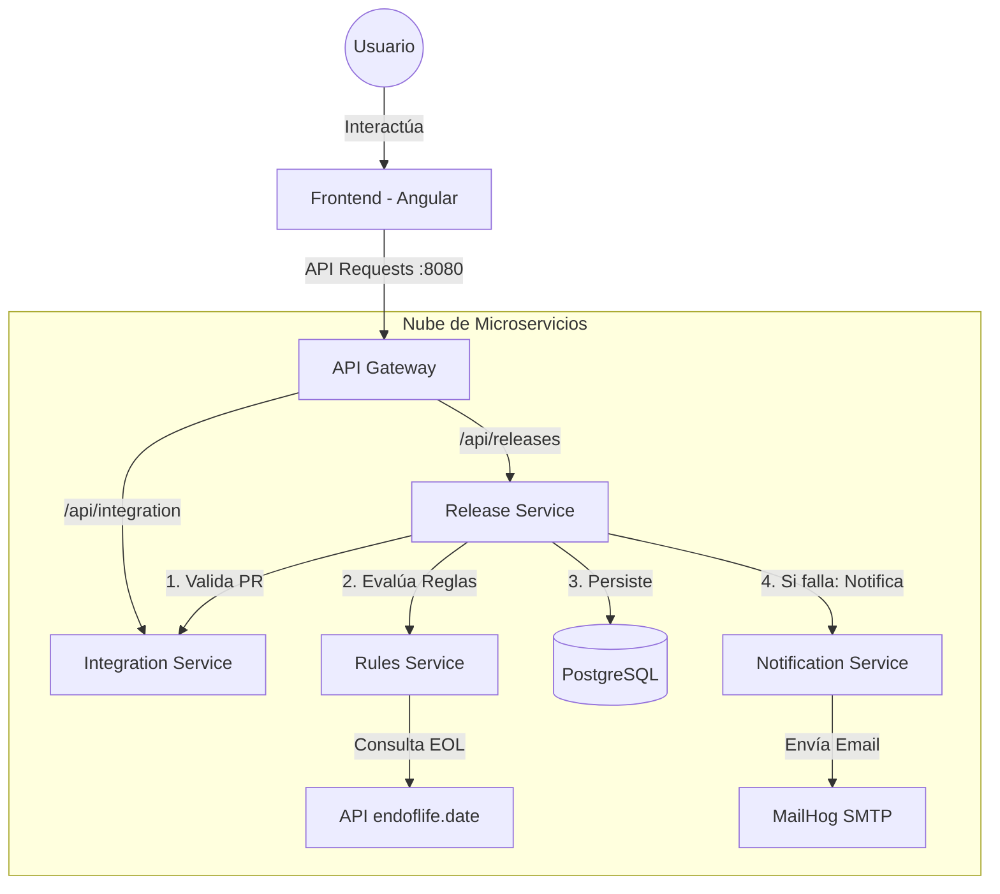

# 🏗️ Arquitectura del Backend - Kata Middle

Este documento explica cómo funciona el sistema de microservicios de la aplicación de automatización de releases.

## 1. 🧩 Diagrama de Componentes

---

## 2. 🚦 API Gateway (El Puerto de Entrada)

El **API Gateway** es el único servicio expuesto al exterior. Piensa en él como la recepción de un edificio:
*   **Routing:** Cuando llega una petición a `/api/integration/analyze`, el Gateway mira su configuración (`application.yml`) y dice: *"Ah, esto va para el servicio que corre internamente en el puerto 8083"*.
*   **RewritePath:** Limpia la URL. Transforma `/api/integration/test` en `/integration/test` para que el microservicio destino reciba la ruta que espera.
*   **CORS:** Centraliza los permisos de seguridad para que el navegador permita las llamadas desde el frontend.

---

## 3. 🧠 Microservicios Detallados

### A. Release Service (:8081)
Es el **Orquestador Central**. No toma decisiones pesadas, sino que delega:
1.  Recibe la solicitud del usuario.
2.  Le pregunta al `Integration Service` si el PR existe.
3.  Le envía todos los datos al `Rules Service` para saber si se aprueba.
4.  Guarda el resultado final en la base de datos.

### B. Rules Service (:8082)
Es el **Motor de Reglas**. Su única misión es decir "SÍ" o "NO" (y por qué).
*   Utiliza el **Patrón Strategy**: tiene una lista de reglas independientes (`CoverageRule`, `StackObsolescenceRule`, etc.).
*   Si una sola regla falla, el release no se aprueba automáticamente.

### C. Integration Service (:8083)
Es el **Conector Externo**. Simula o realiza llamadas a herramientas fuera de nuestro sistema:
*   **GitHub Mock:** Verifica si una URL de PR es válida.
*   **DeepWiki AI:** Analiza el repositorio para adivinar qué tecnología usa (Java, React, etc.).

### D. Notification Service (:8084)
Es el **Servicio de Alerta**. 
*   Escucha órdenes para enviar correos.
*   Está conectado a un servidor SMTP (en este caso **MailHog**) para que podamos ver los correos en una interfaz web sin enviar emails reales.

---

## 4. 🔄 Flujo de una Solicitud (E2E)

1.  El usuario pulsa **"Enviar Solicitud"**.
2.  La petición llega al **Gateway (8080)**.
3.  El Gateway la pasa al **Release Service**.
4.  El **Release Service** pide al **Integration Service** validar el PR.
5.  El **Release Service** pide al **Rules Service** validar las reglas.
6.  El **Rules Service** detecta que el stack es "Java 8" usando `endoflife.date` y retorna un fallo.
7.  El **Release Service** ve el fallo, marca el estado como `PENDIENTE` y le pide al **Notification Service** avisar por correo.
8.  Los datos se guardan en **Postgres**.
9.  El usuario ve en pantalla: *"Requiere Aprobación Manual"*.
